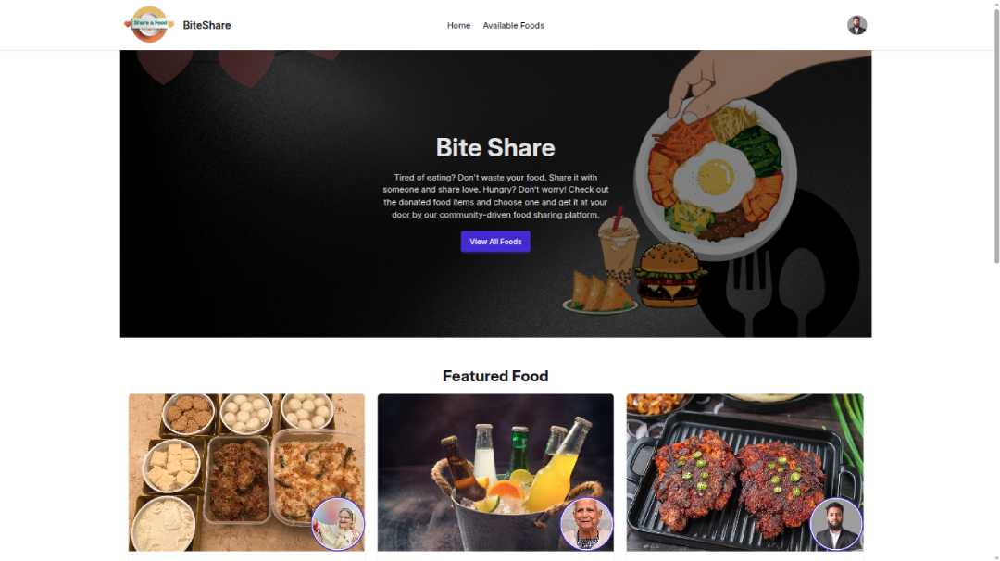

# Project Name : Food Browsering

Share your vite with others

## Overview
**Bite Share** is a MERN stack web application that allows users to share and explore food items (“bites”). Users can add foods, request foods, manage their listed items, and interact through a modern, responsive interface.



## Features

### Authentication
- Secure user login using Email & Password
- Google Sign-In support
- Protected routes based on user authentication

### Food Browsing
- Home page shows Top Available Foods sorted by quantity
- View All available Foods
- Detailed Food Information Page for every item

### Add & Manage Foods
- Users can add new food items
- Users can update or delete foods they have posted
- Check all foods added by the logged-in user

### Food Requests
- Users can request any available food item
- Food owners can view incoming requests
- Owners can approve or delete requests

### Responsive & Smooth UI
- Fully responsive for mobile, tablet, laptop, and desktop
- Clean and modern UI
- Smooth interactions + toast notifications

## Technologies
### Frontend
- HTML
- Tailwind CSS & Daisy UI
- JavaScript
- React Js

### Backend
- Node JS
- Express Js
- MongoDb
- Firebase Auth

Responsive for mobile, tablet, laptop and desktop PC

## Used Tools and others
- Google Fonts API : Inter font
- React Router
- FontAwsome Icons
- React Toastify (notification)
- SweetAlert 2 (notification)
- Motion (animation)
- axios (API client)

## Installation / Running Locally
1. Clone the repository:
   ```bash
   git clone https://github.com/nayem-ahmedz/bite-share.git
   ```
2. Navigate to the project folder:
   ```bash
   cd bite-share
   ```
3. Install dependencies:
   ```bash
   npm install
   ```
4. Ensure you have filled .env file (see .env.example)
5. Start the development server:
   ```bash
   npm run dev
   ```

## Project Timeline
- created on 10 Nov 2025
- completed on 13 Nov 2025
- last updated on 30 Jan 2025

## live link
[BiteShare](https://bite-sharee.vercel.app)
[Server repo](https://github.com/nayem-ahmedz/bite-share-server)

Feel free to contact for any query! Liked it? give a star